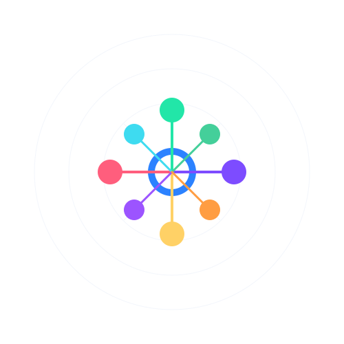

# OpenTranslate

<div align="center">
  
  
  A Universal Knowledge & Code Translation Network
  
  [](https://www.opentranslate.world)
  [](https://x.com/_OpenTranslate)
</div>

## Vision

OpenTranslate is dedicated to breaking down all knowledge barriers by building a universal translation network for all forms of specialized knowledge. We believe that knowledge should flow without borders, and every individual should be able to access and contribute to cutting-edge discoveries in their native language, whether it's scientific research, code, technical documentation, or traditional knowledge.

## Overview

OpenTranslate is a decentralized platform that enables high-quality translations through a combination of human translators, validators, AI assistance, and quantum-enhanced algorithms. The platform uses blockchain technology to ensure transparency, fairness, and proper reward distribution across multiple knowledge domains.

### Key Features

- 🌐 **Universal Translation Network**
  - Scientific research translation
  - Code translation and explanation
  - Technical documentation localization
  - Domain-specific terminology networks
  - Traditional knowledge preservation
  - AI prompt engineering library

- 🤖 **Quantum-Enhanced Translation**
  - Quantum entanglement-inspired algorithms
  - Superposition-based context awareness
  - Quantum-state translation memory
  - Anti-quantum security layer
  - Domain classification quantum networks

- ⛓️ **Blockchain Integration**
  - PUMPFUN token for rewards
  - Smart contracts for translation management
  - Transparent reward distribution
  - Staking and validation system
  - DAO governance structure

- 🎯 **Multi-Platform Interface**
  - Web-based translation interface
  - IDE plugins for code translation
  - Mobile applications
  - API integration
  - Real-time collaboration tools

## Revolutionary Use Cases

### Quantum Computing Acceleration
Japanese quantum physicist's error correction technique translated into 24 languages, accelerating global quantum computing development by 14 months.

### AI Prompt Engineering Cross-Pollination
Senegalese developer's medical diagnostic prompt translated into 30+ languages, improving global healthcare AI applications.

### Code Translation & Explanation
Vietnamese TypeScript algorithm automatically translated to Python, Rust, and C++, with natural language explanations in 40+ languages.

### Technical Documentation Revolution
Chinese EV manufacturer's documentation instantly available globally, eliminating localization delays.

### Indigenous Knowledge Network
Traditional ecological knowledge translated while preserving cultural context, enabling unprecedented collaboration between traditional and modern science.

## Project Structure

```
opentranslate/
├── ai/                 # AI and quantum models
│   ├── models/        # Translation, validation, and domain models
│   ├── quantum/       # Quantum-enhanced algorithms
│   └── training/      # Model training scripts
├── api/               # REST API implementation
├── blockchain/        # Smart contracts and blockchain integration
├── cli/               # Command-line interface
├── config/            # Configuration files
├── core/              # Core functionality
│   ├── blockchain/    # Blockchain integration
│   ├── translator/    # Translation engine
│   ├── validator/     # Validation system
│   └── quantum/       # Quantum computing integration
├── models/            # Database models
├── scripts/           # Utility scripts
├── utils/             # Utility functions
├── web/               # Web interface
└── worker/            # Background tasks
```

## Prerequisites

- Python 3.8+
- Node.js 14+
- Solidity 0.8.0+
- PostgreSQL 12+
- Redis 6+
- Web3.py
- PyTorch
- Transformers
- FastAPI
- Streamlit
- Quantum computing libraries (optional)

## Quick Start

### Installation

1. Clone the repository:
```bash
git clone https://github.com/opentranslate/opentranslate.git
cd opentranslate
```

2. Create and activate a virtual environment:
```bash
python -m venv venv
source venv/bin/activate  # Linux/Mac
venv\Scripts\activate     # Windows
```

3. Install dependencies:
```bash
pip install -e ".[dev]"
```

4. Set up environment variables:
```bash
cp .env.example .env
# Edit .env with your settings
```

5. Initialize the database:
```bash
opentranslate db init
opentranslate db migrate
opentranslate db upgrade
```

## Development

1. Install development dependencies:
```bash
pip install -e ".[dev]"
```

2. Run tests:
```bash
pytest
```

3. Format code:
```bash
black .
isort .
```

4. Check code quality:
```bash
flake8
mypy .
```

## Documentation

- API Documentation: https://docs.opentranslate.world/api
- User Guide: https://docs.opentranslate.world/guide
- Developer Guide: https://docs.opentranslate.world/dev

## Contributing

1. Fork the repository
2. Create a feature branch
3. Commit your changes
4. Push to the branch
5. Create a Pull Request

## License

MIT License 